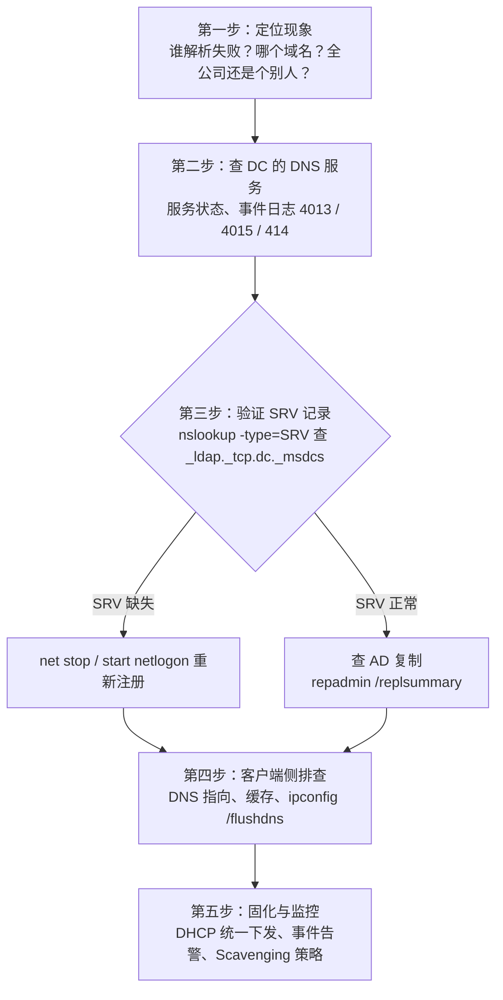

# 集团域控 DNS 异常排查实战

> 今天，我们用实战案例讲透集团 AD 环境中的 DNS 排障方法。把集团环境最常见的 DNS 异常按“现象 → 根因 → 处理”固化，配套标准排障流程、命令速查和实验验证。

## 1. 域控 DNS 的工作原理

AD 域环境里，DNS 是域定位的根基：

| 依赖关系 | 说明 |
| --- | --- |
| 客户端加域 / 登录 | 靠 SRV 记录定位 DC（`_ldap._tcp.dc._msdcs.<域名>`） |
| DC 间复制 | 靠 DNS 解析伙伴 DC 的 A 记录 + `_msdcs` 委派 |
| Exchange / SCCM 等业务系统 | 靠 DNS 定位 DC 做身份验证 |
| 外部解析 | DC 上的转发器（Forwarder）把非 AD 域名丢给公网 DNS |

> **核心结论**：域内一切 DNS 异常，最终都可以归类到四个层面——**客户端指向错、DNS 服务本身异常、SRV/记录缺失、AD 复制故障**。排障就是逐层排除。

## 2. 标准排障流程



> [!TIP] 第一诊断命令
> 在 DC 上跑 `dcdiag /test:dns`，按“基本 / 转发 / 委派 / 动态更新 / SRV 记录”子项逐条给 PASS/FAIL，比零散查快得多。

## 3. 常见异常对照表

| 编号 | 异常现象 | 典型根因 | 处理动作 |
| --- | --- | --- | --- |
| D-01 | 客户端登录慢、加域报“找不到域控制器” | 网卡 DNS 指向了公网 DNS 或路由器，不是 DC | 客户端首选 DNS 必须指向域内 DC；用 DHCP 统一下发，杜绝手工改 |
| D-02 | `nslookup -type=SRV` 查不到 `_ldap._tcp.dc._msdcs.<域名>` | Netlogon 没注册 SRV，常见于 DC 重装 / 升级后 | DC 上 `net stop netlogon && net start netlogon`，或 `ipconfig /registerdns` |
| D-03 | DNS 服务启动后长时间不响应查询 | AD 集成区在等待 AD 加载（事件 4013），多 DC 同时重启时常见 | 属正常等待；若长时间卡住，查 AD DS 服务与 FSMO 指向 |
| D-04 | 解析出旧 IP、访问到已下线机器 | 动态更新失败、DHCP 作用域变更后陈旧记录残留 | 开 DNS 老化与清理（Scavenging）；手工删陈旧 A/PTR，客户端 `ipconfig /registerdns` |
| D-05 | 多 DC 间 DNS 记录不一致 | AD 复制故障（DNS 集成区跟着 AD 复制走） | `repadmin /replsummary` 定位复制断点；恢复复制后 DNS 自然一致 |
| D-06 | 外网域名解析慢或失败 | 转发器配置错误或指向不通的运营商 DNS | DNS 属性配可靠转发器（如 114.114.114.114 / 企业出口 DNS）；禁用无意义根提示 |
| D-07 | 部分分支站点解析正常、部分异常 | 分支客户端指向远端 DC 的 DNS，跨 WAN 抖动 | 按站点部署分支 DC/DNS；配置子网-站点映射让客户端就近解析 |
| D-08 | 事件日志大量 4015 / 4004 | DNS 无法与 AD 同步，多为复制或权限问题 | 先 `dcdiag /test:dns` 看哪项 FAIL，再回溯复制与权限 |
| D-09 | 客户端“注册到 DNS”失败，动态更新记录缺失 | 客户端 DNS 后缀与区域名不一致，或区域仅允许安全更新但权限受限 | 核对 DNS 后缀；区域设为“安全动态更新”，确保计算机账户在域内正常 |
| D-10 | 反向解析（PTR）查不到 | 反向查找区域没建，或 DHCP 没勾选“动态更新 PTR” | 建对应反向区域；DHCP 作用域勾选为客户端更新 PTR |
| D-11 | 误删 DNS 区域后全域瘫痪 | 管理员误操作删除 AD 集成区 | 从系统状态备份还原；日常用“仅查看权限”限制 DNS 管理入口 |
| D-12 | 防病毒 / EDR 拦截后 DNS 服务异常 | 安全软件过滤 53 端口或误杀 dns.exe | 加白名单（`dns.exe`、`%SystemRoot%\System32\dns\`） |

## 4. 命令速查手册

### 4.1 诊断类

```cmd
:: 一键 DNS 体检（DC 上执行，第一命令）
dcdiag /test:dns /v

:: 验证 SRV 记录（在任意客户端执行）
nslookup -type=SRV _ldap._tcp.dc._msdcs.zsmls.local

:: 验证本机定位域控
nltest /dsgetdc:zsmls.local

:: AD 复制健康总览（多 DC 必查）
repadmin /replsummary
repadmin /showrepl

:: 查询具体记录走哪台服务器
nslookup
> server 192.168.10.1
> www.baidu.com
```

### 4.2 修复类

```cmd
:: SRV 记录重建（DC 上执行，SRV 缺失的首选手段）
net stop netlogon && net start netlogon
ipconfig /registerdns

:: 客户端缓存清理与重新注册
ipconfig /flushdns
ipconfig /registerdns

:: DNS 服务重启
net stop dns && net start dns
```

## 5. 预防性配置（治本）

异常是治标，配置才是治本。集团环境建议固化以下五条：

| 策略 | 配置要点 |
| --- | --- |
| DHCP 统一下发 DNS | 作用域选项：首选 = 本站点 DC，备用 = 总部 DC；禁止任何客户端手工指向公网 DNS |
| DC 自身 DNS 指向 | 首选 = 自己，备用 = 同站点另一台 DC；绝不指向 ISP DNS（否则引发 4013 慢启动） |
| Scavenging 老化清理 | 只在一台 DNS 服务器上开，区域级启用 + 服务器级设周期；全网乱开会误删正常记录 |
| 转发器 | 统一指向企业出口 DNS 或 114.114.114.114 / 223.5.5.5；不要各 DC 各配各的 |
| 事件告警 | 监控 4013 / 4015 / 4004 / 414 事件，接入 Zabbix / 企微告警，先于用户发现 |

## 总结

希望本文能够帮你建立一套完整的 DNS 故障分析思维。下次再遇到域登录失败、域控失联、GPO 异常时，第一时间想到的不是重启，而是 DNS。

## 参考

- 原文来源：[集团域控 DNS 异常排查实战（微信公众号 · 老季聊数字化）](https://mp.weixin.qq.com/s/ND2WV5hWFT1E1_oUcfTgQg)
